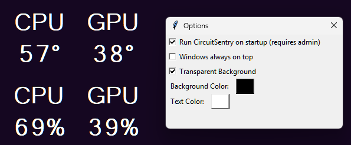

# CircuitSentry v1.0.0

A lightweight Windows overlay app that shows live CPU and GPU temperature and usage.



---

## 🎯 Quick start for users

CircuitSentry is designed to be simple: download the executable, get the support files, and run it.

### Run in 3 easy steps

1. Download `CircuitSentry.exe`.
2. Download these support files and place them in the same folder:
   - `LibreHardwareMonitorLib.dll` — https://github.com/LibreHardwareMonitor/LibreHardwareMonitor/releases
   - `HidSharp.dll` — https://github.com/zeno81/HidSharp/releases
3. Double-click `CircuitSentry.exe`.

Your download folder should contain the app and the two support DLLs:

```text
CircuitSentryUserFolder/
├── CircuitSentry.exe
├── LibreHardwareMonitorLib.dll
└── HidSharp.dll
```

That’s it. The app will open and start showing your CPU and GPU stats.

---

## 🧰 What CircuitSentry shows

- CPU temperature
- GPU temperature
- CPU usage
- GPU usage

The window can be dragged anywhere, hidden to the tray, and configured with a right-click menu.

---

## 🛠️ For developers

### Run from source

1. Install Python 3.
2. Install dependencies:

```bash
pip install pythonnet pystray pillow tendo
```

3. Download the DLL support files and place them in the project folder.
4. Run:

```bash
python circuitsentry.py
```

### Build a Windows executable

```bash
python -m PyInstaller circuitsentry.py --onefile --noconsole --icon=circuitsentry.ico --name=CircuitSentry.exe --add-data "circuitsentry.ico;."
```

After building, copy `LibreHardwareMonitorLib.dll` and `HidSharp.dll` into the same folder as `CircuitSentry.exe` before running.

---

## ⚠️ Notes

- Only one instance of CircuitSentry can run at a time.
- The app depends on LibreHardwareMonitor sensor support.
- `.dll` files are excluded from this repository via `.gitignore`.
- There is now an option to install an elevated startup task so the app can start with the privileges needed to read CPU temperature on startup.
